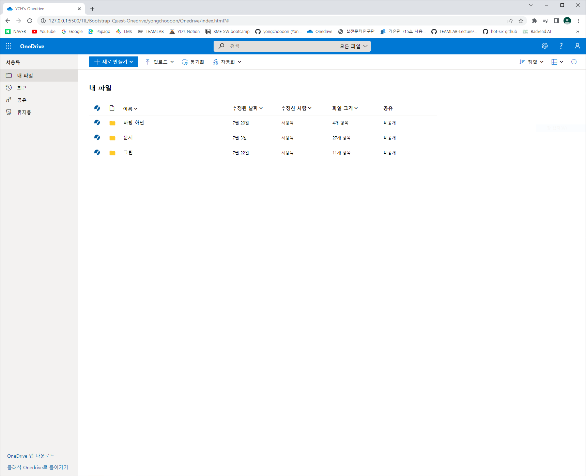

#  Bootstrap and API

- [Bootstrap_Basic.md](./Bootstrap_Basic.md)
- [API_Basic.md](./API_Basic.md)
  - [Youtube link](https://www.youtube.com/watch?v=QPEUU89AOg8)
  - 관련 코드는 영상에서 보고 다음에 사용할 때 다시 공부하기
---

## Week 3 Quest
- Onedrive : [Example link](https://github.com/jsw6872/TIL/tree/main/Onedrive)

### Quest 1 - Onedrive

- My Assignment
  - [index.html](./yongchoooon/Onedrive/index.html)
  - [onedrive.css](./yongchoooon/Onedrive/onedrive.css)
  - [onedrive.js](./yongchoooon/Onedrive/onedrive.js)

