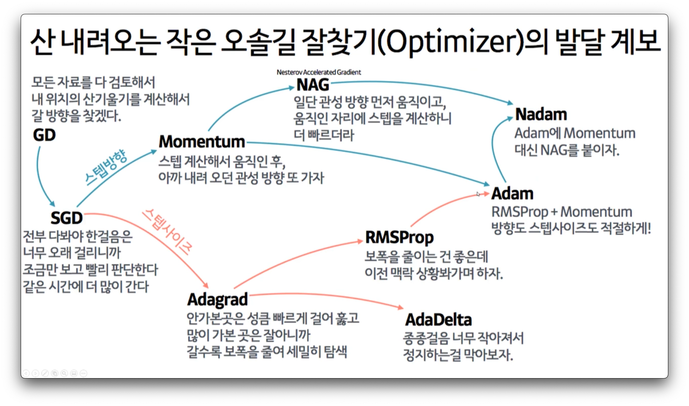
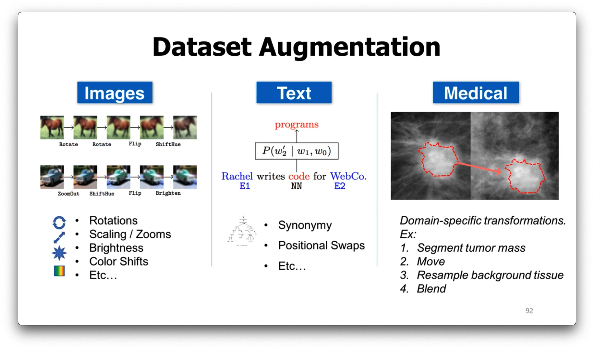

# Model optimization and Generalization
## How to overcome overfitting
- Approach 1 : 더 많은 데이터 확보
- Approach 2 : 모델 복잡도를 낮추기 (Use a model with the right capacity)
- Approach 3 : 모델을 여러 개 만들어서 예측 (앙상블 모델; Average many different models)
- Approach 4 : **Use skills** (DropOut, DropConnect, or BatchNorm)
- **Use bettor optimizer**

### Limiting the Capacity
- Architecture : Hidden layers and units per layer를 줄이기
- Early Stopping : overfitting 되기 전에 학습을 멈추기
- Weight-decay : Penalize large weights using penalties or constraints on their squared values (L2 penalty) or absolute values (l1 penalty)
- DropOut : Batch or Epochs이 돌 때마다 값을 0으로 만들어 주는 것. 말그대로 node를 drop out 하는 것.
  - gradient update가 되지 않도록 해주는 것.
- DropConnect : weight 값을 0으로 만들어 주는 것.
- BatchNorm : 값과 weight 모두 없애버림.

## Optimization

- **SGD** : Stochastic Gradient Descent
  - [ML/SGD](../ML/Linear_Regression/LR_5.ipynb)
  - 원래 의미는 dataset에서 random하게 training sample을 뽑은 후 학습할 때 사용함
  - 일반적으로 SGD라고 하면 Mini batch SGD를 의미함.
    - full-batch와는 다르게 Mini batch라고 하면 일부 데이터만을 학습시키는 것.
  - SGD로부터 다양한 Optimization 알고리즘이 파생됨. (학습의 속도, 방향을 올릴 수 있는 방향으로 알고리즘이 발전)
  - 가장 중요한 하이퍼파라미터는 **`learning rate`**
    - 실제에서는 `learning rate decay`를 사용함. (조금씩 learning rate를 줄이는 것; 근데 만약 Adam이나 AdaGrad를 쓰면 이게 필요없음)
    - **Learning Rate Scheduling**
      - [link](https://sanghyu.tistory.com/113)
      - LambdaLR, MultiplicativeLR, StepLR, MultiStepLR, ExponentialLR, CosineAnnealingLR 등
        - [API Document](https://pytorch.org/docs/stable/optim.html)

- **Momentum**
  - GD를 통해 이동하는 과정에 일종의 `관성`을 추가한 것
  - 과거에 이동했던 방식을 기억해 그 방향으로 추가 이동하는 것
  - 이를 통해 local minimum에서 잘 빠져나올 수 있도록 함.
  - *근데 사실 요즘엔 잘 안 씀*

- **NAG**(Nesterov Accelerated Gradient)
  - Momentum을 기초로 한 방식, Gradient 계산 방식이 상이함
  - *요즘에 안 씀*

- **AdaGrad**(Adaptive Gradient)
  - 개별 weight paramete 별로 adaptive하게 learning rate를 조절하는 기법
  - 지금까지 많이 변화하지 않은 변수들은 `step size`를 크게, 지금까지 많이 변화했던 변수들은 `step size`를 작게
  - 지금까지 많이 변화하지 않은 변수들은 `step size`를 크게, 지금까지 많이 변화했던 변수들은 `step size`를 작게
  - 수동으로 학습 속도를 조정할 필요가 없음
  - 추가된 값은 양수 -> 누적 합계가 계속 증가 -> 학습 속도 감소 -> 궁극적으로 극히 작아짐 -> 학습 종료
  - 가장 큰 약점 : 분모에 제곱된 기울기가 축적됨

- **RMSProp**
  - AdaGrad의 단점을 해결
  - AdaGrad의 식에서 gradient의 제곱값을 더해나가면서 구한 $G_t$부분을 합이 아니라 `이동평균`으로 변경

- **Adadelta**
  - RMSProp과 유사하게 AdaGrad의 단점을 보완
  - AdaDelta는 RMSProp과 동일하게$G$를 구할 떄 합을 구하는 대신 이동평균을 구한다.
  - step size를 단순하게 $\eta$로 사용하는 대신 step size의 변화값의 제곱을 가지고 이동평균 값을 사용

- **Adam**(Adaptive Moment Estimation)
  - RMSProp + Momentum
  - SGD와 함께 가장 많이 사용되는 optimizer
  - Momentum 방식과 유사하게 지금까지 계산해 온 기울기의 이동평균을 저장, RMSProp과 육사하게 기울기의 제곱값 이동평균을 저장
  - Default 하이퍼 파라미터에도 강건하게 작동한다.
  - `Nan`의 향연이 시작되면 `epsilon` 값을 조정해보자. (0.1 ~ 1 사이의 값으로 좀 크게 해보자)

## Generalization
- **Parameter Norm Penalties**
  - Limiting the capacity of models by adding a parameter norm penalty to the objective function
  - L2, L1

- **Dataset Augmentation**
  
  - **많은 데이터**를 모델에 학습시키는 것이 generalization에 있어 가장 좋은 방법이다.
  - 데이터셋의 크기에는 한계가 있기 때문에, **`fake data`**를 생성해서 training dataset에 추가하는 방식.
  - Images
    - Rotations
    - Scaling / Zooms
    - Brightness
    - Color Shifts
    - Etc..
  - Text
    - Synonym insertion
    - Positional Swaps
    - Etc..

- **Semi-Supervised Learning**
  - `unlabeled examples`와 `labeled examples`를 모두 사용하여 학습
  - 딥러닝에서는 representation을 학습하는 것을 의미함.
    - 같은 클래스의 examples가 비슷한 representation을 가진다는 사실을 학습시키는 것이 목표

- 이외에도..
  - Multi-Task Learning
  - Early Stopping
  - Parameter Sharing
  - Bagging and Other Ensemble Methods
  - Adversarial Training