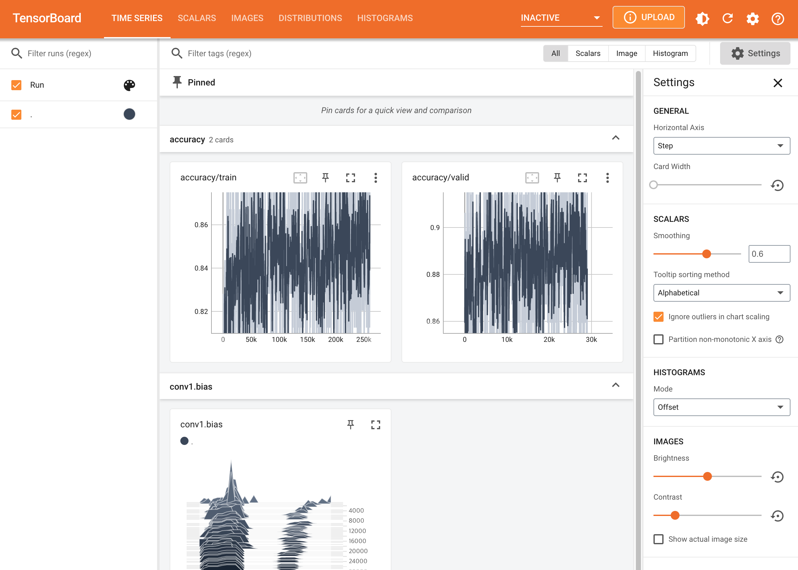
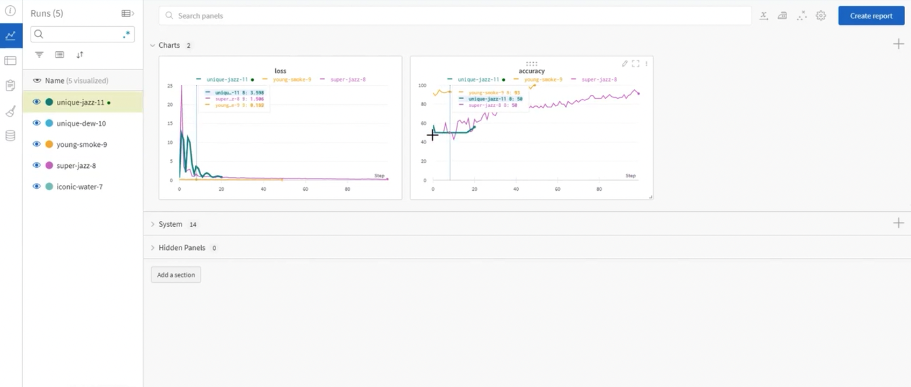

# Monitoring tools for Pytorch
> 학습 시간이 매우 길기 때문에 기다리는 동안 기록이 필요함

### Tensorboard
- TensorFlow의 프로젝트로 만들어진 시각화 도구
- 학습 그래프, metric, 학습 결과의 시각화 지원
- PyTorch도 연결 가능 -> DL 시각화 핵심 도구
- 주요 기능
  - scalar : metric 등 상수 값의 연속(epoch)을 표시
  - graph : 모델의 computational graph 표시
  - histogram : weight 등 값의 분포를 표현
  - image : 예측 값과 실제 값을 비교 표시
  - mesh : 3d 형태의 데이터를 표현하는 도구
- 다음과 같은 명령어로 실행하면 기본 port 6006에 열림
  - `tensorboard --logdir "logs"`

### Weight & Biases
- 머신러닝 실험을 원활히 지원하기 위한 상용도구
- 협업, code versioning, 실험 결과 기록 등 기능 제공
- MLOps의 대표적인 툴로 저변 확대 중

