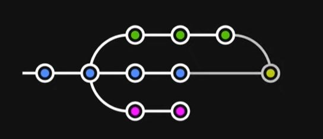
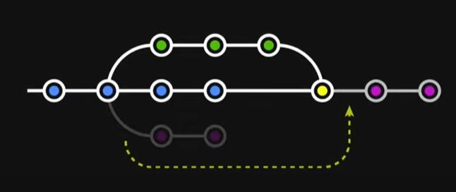

# 1. Branch (분기된 가지, 다른 차원)
- 프로젝트를 하나 이상의 모습으로 관리해야 할 때
    - 예) 실배포용, 테스트 서버용, 새로운 시도용
- 여러 작업들이 각각 독립되어 진행될 때
    - 예) 신기능 1, 신기능 2, 코드 개선, 긴급수정
    - 각각의 차원에서 작업한 뒤 확정된 것을 메인 차원에 통합
```bash
이 모든 것을 하나의 프로젝트 폴더에서 진행될 수 있도록 함
```

# 2. 명령어
- Branch 생성
    - `git branch (이름)`
- Branch 목록 확인
    - `git branch`
- Branch 이동
    - `git switch (이름)`
- Branch 생성과 동시에 이동하기
    - `git switch -c (이름)`
- Branch 삭제
    - `git branch -d (이름)`
- Branch 이름 변경
    - `git branch -m (기존 브랜치명) (새 브랜치명)`

# 3. 각각의 브랜치에서 서로 다른 작업해보기
- main 브랜치에서 작업한 후 변경사항을 add & commit 하고 나서
- 새로운 브랜치 git_test로 switch하고 다른 작업을 진행한 후 변경사항을 add & commit하면
- 이는 즉 다른 각각의 branch에서 진행된 것이므로 branch를 switch할 때마다 파일의 내용이 바뀌어서 나타나게 됨.
- 각기 다른 branch 상에서 파일을 생성하거나 삭제했을 경우에도 진행상황이 해당 branch에서만 국한되게 기록됨
- `git log`를 통해 각기 다른 branch에서의 변경사항을 확인할 수 있고, 소스트리에서도 직관적으로 확인 가능
- git bash에서 시각적으로 확인하는 방법
    - `git log --all --decorate --oneline --graph`

# 4. Branch를 합치는 2가지 방법
## 1) Merge


- 병합의 개념
- 초록색 Branch와 파란색 Branch의 두 가지를 하나로 이어 붙이는 것.
- Merge 이전의 branch들의 History가 다 남음.
## 2) Rebase


- Branch의 마디(commit)들을 대상 Branch로 옮겨붙이는 것.
- History가 깔끔하게 한 줄로 정리됨.